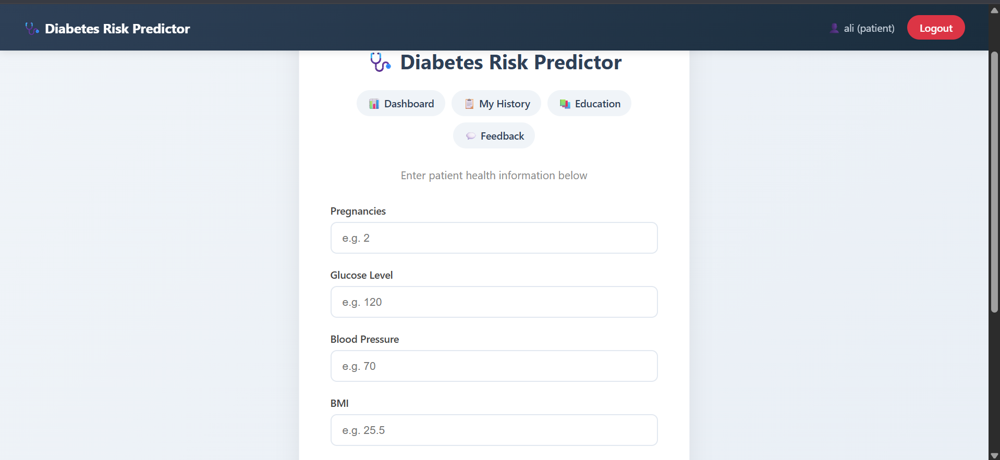
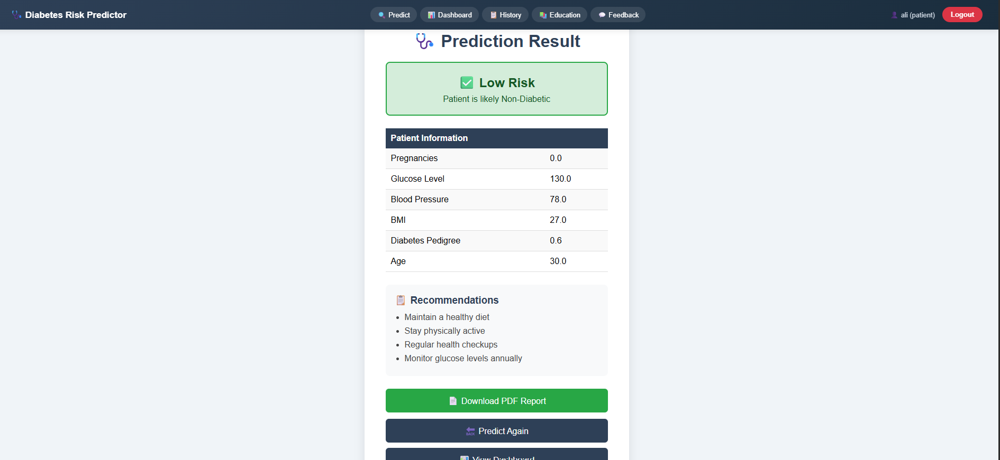
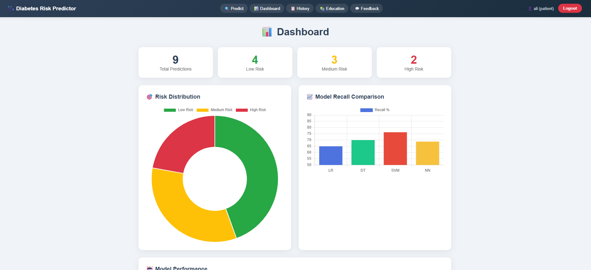
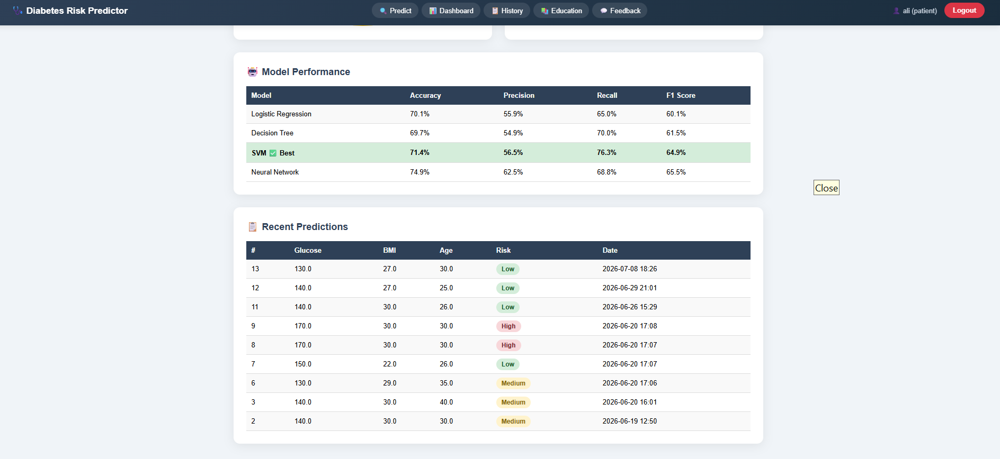
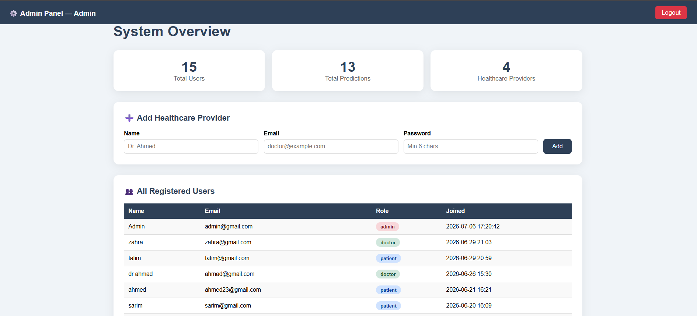
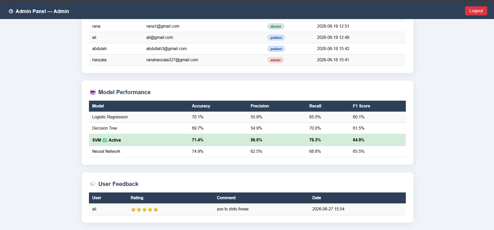
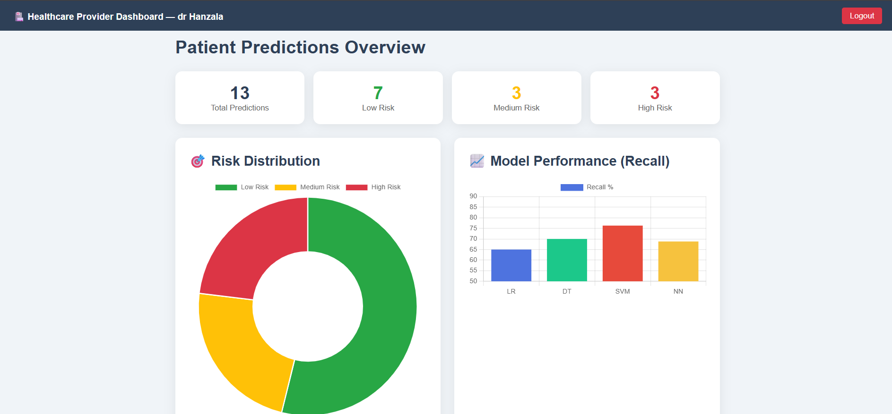
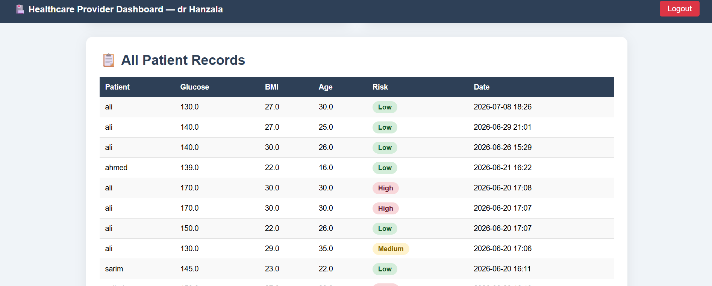

# 🩺 Diabetes Risk Prediction Web Application

> A role-based healthcare decision-support prototype that uses an offline-trained SVM model to predict diabetes risk, providing dashboards, patient history, feedback, and downloadable PDF reports through a Flask web interface.

**Course:** CS619 — Final Year Project  
**Student:** Hanzala Iftikhar  

---

## ⚠️ Healthcare Disclaimer

> **This system is a prototype decision-support tool built for educational purposes only.**  
> It does **not** replace professional medical advice, diagnosis, or treatment.  
> Always consult a qualified healthcare provider for any medical concerns.

---

## 📋 Table of Contents

- [🩺 Diabetes Risk Prediction Web Application](#-diabetes-risk-prediction-web-application)
  - [⚠️ Healthcare Disclaimer](#️-healthcare-disclaimer)
  - [📋 Table of Contents](#-table-of-contents)
  - [✨ Features](#-features)
  - [👥 User Roles](#-user-roles)
  - [🛠️ Tech Stack](#️-tech-stack)
  - [🤖 ML Workflow Summary](#-ml-workflow-summary)
  - [🔗 Flask Integration Summary](#-flask-integration-summary)
  - [📁 Project Structure](#-project-structure)
  - [🚀 Installation \& Local Setup](#-installation--local-setup)
    - [Prerequisites](#prerequisites)
    - [Step 1 — Clone the repository](#step-1--clone-the-repository)
    - [Step 2 — Create and activate a virtual environment](#step-2--create-and-activate-a-virtual-environment)
    - [Step 3 — Install dependencies](#step-3--install-dependencies)
    - [Step 4 — Configure the secret key](#step-4--configure-the-secret-key)
    - [Step 5 — Create the admin account](#step-5--create-the-admin-account)
    - [Step 6 — Run the application](#step-6--run-the-application)
  - [🔑 Demo Credentials](#-demo-credentials)
  - [📸 Screenshots](#-screenshots)
    - [Prediction Form](#prediction-form)
    - [Result Page](#result-page)
    - [Patient Dashboard](#patient-dashboard)
    - [Admin Panel](#admin-panel)
    - [Doctor Dashboard](#doctor-dashboard)
  - [🔒 Security Notes](#-security-notes)
  - [🔮 Future Improvements](#-future-improvements)

---

## ✨ Features

- **Diabetes Risk Prediction** using a trained SVM (Support Vector Machine) model
- **Three-level risk output:** Low / Medium / High with tailored health recommendations
- **Downloadable PDF reports** for each prediction
- **Patient Dashboard** with risk distribution charts (Chart.js)
- **Prediction History** — patients can view all their past predictions
- **Doctor Dashboard** — view all patients' records across the system
- **Admin Panel** — manage users, add doctor accounts, view system stats
- **Diabetes Education** page with risk factors and prevention guidelines
- **Feedback System** with star rating and comments
- **Role-based access control** — each role sees only what it should
- **Password hashing** using Werkzeug's secure hash functions

---

## 👥 User Roles

| Role | How Created | Access |
|------|-------------|--------|
| **Patient** | Self-registration at `/register` | Prediction form, their own dashboard, history, PDF reports, education, feedback |
| **Doctor** | Created by Admin only | Read-only view of all patients' prediction records and risk statistics |
| **Admin** | Created via `create_admin.py` script | User management, system stats, ability to add doctor accounts |

---

## 🛠️ Tech Stack

| Layer | Technology |
|-------|-----------|
| Backend | Python 3.x, Flask 3.x |
| ML Model | scikit-learn (SVM), joblib |
| Data Processing | NumPy |
| Database | SQLite (via Python's built-in `sqlite3`) |
| PDF Generation | fpdf2 |
| Password Security | Werkzeug |
| Frontend | HTML5, CSS3, JavaScript |
| Charts | Chart.js (CDN) |
| Environment Config | python-dotenv |

---

## 🤖 ML Workflow Summary

The machine learning model was trained in `Diabetes_FYP.ipynb` using the **Pima Indians Diabetes Dataset**.

**Pipeline:**

1. **Dataset:** 768 samples, originally 9 columns
2. **Feature Dropping:** `Skin` and `test` columns removed (too many zero values)
3. **Zero-Value Imputation:** `pres`, `plas`, `mass` zero values replaced with column medians
4. **Final Features (6):** `preg`, `plas`, `pres`, `mass`, `pedi`, `age`
5. **Train/Test Split:** 70% train, 30% test (`random_state=42`)
6. **SMOTE Balancing:** Applied on training set only to address class imbalance
7. **Feature Scaling:** `StandardScaler` fitted on SMOTE-balanced training data
8. **Models Compared:**

| Model | Accuracy | Precision | Recall | F1 Score |
|-------|----------|-----------|--------|----------|
| Logistic Regression | 70.1% | 55.9% | 65.0% | 60.1% |
| Decision Tree | 69.7% | 54.9% | 70.0% | 61.5% |
| **SVM ✅ (Selected)** | **71.4%** | **56.5%** | **76.3%** | **64.9%** |
| Neural Network | 74.9% | 62.5% | 68.8% | 65.5% |

9. **Why SVM?** Recall was prioritised for medical risk screening — it is more important to correctly identify diabetic cases (avoid false negatives) than to maximise accuracy.
10. **Saved Artifacts:** `diabetes_model.pkl` (SVM model) and `scaler.pkl` (fitted StandardScaler)

---

## 🔗 Flask Integration Summary

The Flask app (`app.py`) loads the saved model and scaler at startup using project-safe paths:

```python
model = joblib.load(MODEL_PATH)
scaler = joblib.load(SCALER_PATH)
```

On prediction, the 6 input values are scaled using the same scaler, then passed to the model:

```python
input_data   = np.array([[preg, plas, pres, mass, pedi, age]])
input_scaled = scaler.transform(input_data)
result       = model.predict(input_scaled)[0]
```

**⚠️ Important:** The feature order must always be `preg → plas → pres → mass → pedi → age`. Changing this order will produce incorrect predictions without any error.

---

## 📁 Project Structure

```
diabetes-risk-predictor/
│
├── app.py                    # Main Flask application — all routes and logic
├── create_admin.py           # One-time script to create the admin account
├── requirements.txt          # Python package dependencies
├── .gitignore                # Files excluded from version control
├── .env                      # Secret key config — NOT committed to Git
├── .env.example              # Template showing which env vars are needed
├── LICENSE                   # MIT License
├── README.md                 # This file
│
├── diabetes_model.pkl        # Trained SVM model (committed — no user data)
├── scaler.pkl                # Fitted StandardScaler (committed — no user data)
├── Diabetes_FYP.ipynb        # Full ML training notebook
├── pima-indians-diabetes.data.csv  # Original dataset
│
└── templates/
    ├── index.html            # Patient prediction form (home page)
    ├── login.html            # Login page
    ├── register.html         # Patient self-registration
    ├── result.html           # Prediction result + PDF download
    ├── dashboard.html        # Patient dashboard with charts
    ├── history.html          # Patient prediction history
    ├── doctor.html           # Doctor dashboard (all patients)
    ├── admin.html            # Admin panel (user management)
    ├── education.html        # Diabetes education content
    ├── feedback.html             # Star rating feedback form
    └── access_denied.html        # Access denied page for unauthorized role access
```

> **Note:** `diabetes.db` is excluded from Git (see `.gitignore`). A fresh database is created automatically when you first run the app.

---

## 🚀 Installation & Local Setup

### Prerequisites

- Python 3.12 recommended
- pip

### Step 1 — Clone the repository

```bash
git clone https://github.com/your-username/diabetes-risk-predictor.git
cd diabetes-risk-predictor
```

### Step 2 — Create and activate a virtual environment

```bash
# Windows
python -m venv venv
venv\Scripts\activate

# macOS / Linux
python3 -m venv venv
source venv/bin/activate
```

### Step 3 — Install dependencies

```bash
pip install -r requirements.txt
```

### Step 4 — Configure the secret key

Create a `.env` file in the project root (copy from the example):

```bash
cp .env.example .env
```

Then open `.env` and set a secure secret key:

```
SECRET_KEY=your-long-random-secret-key-here
```

You can generate a good secret key with:

```bash
python -c "import secrets; print(secrets.token_hex(32))"
```

### Step 5 — Create the admin account

Run this script **once** to create the admin user:

```bash
python create_admin.py
```

> This creates the database (`diabetes.db`) automatically if it does not exist.  
> **Change the credentials in `create_admin.py` before running** — do not use the defaults in production.

### Step 6 — Run the application

```bash
python app.py
```

Open your browser and go to: **http://127.0.0.1:5000**

---

## 🔑 Demo Credentials

> **⚠️ These are sample placeholder credentials for documentation purposes only.**  
> Do NOT use these in a real deployed environment.  
> Create your own accounts using `create_admin.py` and the `/register` page.

| Role | Email | Password |
|------|-------|----------|
| Admin | admin@gmail.com | admin123 or the password set in `create_admin.py` |
| Doctor | doctor@example.com | (set via admin panel) |
| Patient | patient@example.com | (set via /register) |

---


## 📸 Screenshots

### Prediction Form


### Result Page


### Patient Dashboard



### Admin Panel



### Doctor Dashboard




| Page | Description |
|------|-------------|
| Login | Role-based login screen |
| Prediction Form | 6-field input form for health parameters |
| Result Page | Risk level display with recommendations |
| Patient Dashboard | Charts + recent predictions |
| Doctor Dashboard | All patients' records overview |
| Admin Panel | User management + model performance table |

---

## 🔒 Security Notes

- **Never commit `diabetes.db`** — it contains user account data. It is listed in `.gitignore`.
- **Never commit `.env`** — it contains the Flask secret key. It is listed in `.gitignore`.
- **Never commit real credentials** in `create_admin.py` — update the defaults before use.
- The `diabetes__env/` virtual environment folder should never be committed — it is OS-specific and very large.
- Passwords are stored as salted hashes using Werkzeug — plaintext passwords are never saved.
- This is a **local development / educational prototype**. Before any public deployment, additional hardening is required (CSRF protection, HTTPS, rate limiting, etc.).

---


## 🔮 Future Improvements

- Add CSRF protection for forms
- Add CSV report export
- Add admin-based model retraining in a future version
- Add pagination for large prediction records
- Deploy the application to a cloud platform